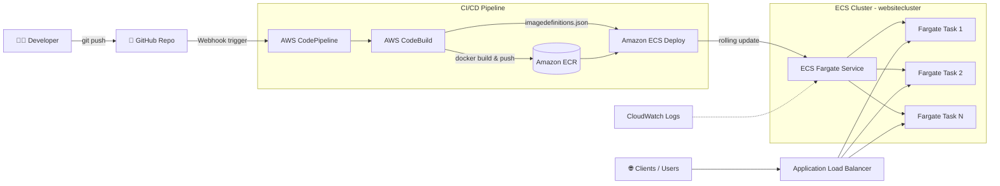

# 🚀 CI/CD Pipeline for a Dockerized Website on AWS ECS Fargate

An end-to-end CI/CD pipeline that automatically builds, containerizes, and deploys a static website to **AWS ECS Fargate** whenever code is pushed to GitHub — using **CodeBuild**, **CodePipeline**, **ECR**, and an **Application Load Balancer** with auto-scaling.

---

## 📐 Architecture



**Flow:** Push to GitHub → CodePipeline triggers → CodeBuild builds Docker image & pushes to ECR → CodePipeline deploys new image to the ECS Fargate service behind an ALB → traffic auto-scales based on CPU utilization.

---

## 🧰 Tech Stack

| Category | Tools / Services |
|---|---|
| Source Control | GitHub |
| Containerization | Docker, Amazon ECR |
| Compute | Amazon ECS (Fargate launch type) |
| Networking | Application Load Balancer (ALB), Target Groups |
| CI/CD | AWS CodeBuild, AWS CodePipeline |
| Monitoring | Amazon CloudWatch Logs, CloudWatch Alarms |
| IAM | Custom roles for EC2, CodeBuild (ECR + Secrets Manager access) |
| Base Image | `nginx:latest` |

---

## 📂 Project Structure

```
website/
├── Dockerfile          # Builds nginx image with static site content
├── buildspec.yml       # CodeBuild instructions (build, tag, push to ECR)
├── index.html          # Website content
└── ...                 # Other static assets
```

---

## ⚙️ Prerequisites

- AWS account with permissions for EC2, ECR, ECS, CodeBuild, CodePipeline, IAM, CloudWatch
- GitHub repository containing the website code, `Dockerfile`, and `buildspec.yml`
- AWS CLI configured (for local/manual steps)
- Basic familiarity with Docker

---

## 🏗️ Setup Guide

### 1. Local Build & Test (EC2)
```bash
# Launch an Amazon Linux 2023 EC2 instance, then:
yum install docker -y
service docker start
service docker status

# Install git and clone the repo
yum install git -y
git clone https://github.com/<your-username>/website.git
cd website

# Build and run the image locally to verify
docker build -t website:latest .
docker run -d -p 80:80 website
# Visit http://<ec2-public-ip> to confirm it works
```

### 2. Push the Image to Amazon ECR
1. Create a private ECR repository named `website`.
2. Attach an IAM role with `AmazonEC2ContainerRegistryFullAccess` to the EC2 instance.
3. Authenticate and push:
```bash
aws ecr get-login-password --region <region> | \
  docker login --username AWS --password-stdin <account-id>.dkr.ecr.<region>.amazonaws.com

docker build -t website .
docker tag website:latest <account-id>.dkr.ecr.<region>.amazonaws.com/website:latest
docker push <account-id>.dkr.ecr.<region>.amazonaws.com/website:latest
```

### 3. Create the ECS Cluster
- Cluster name: `websitecluster`
- Launch type: **Fargate** (managed by AWS, no EC2 to maintain)

### 4. Create a Task Definition
- Family: `website-task-df`
- Launch type: Fargate — 0.25 vCPU / 0.5 GB
- Container: `website`, image = ECR image URI, logging enabled

### 5. Create the ECS Service
- Family: `website-task-df`
- Service name: `websiteservice`
- Desired tasks: `4`
- Networking: default security group, public IP enabled
- Load balancing: attach an **Application Load Balancer** + Target Group
- Auto-scaling: Min `2`, Max `6`, target metric = CPU Utilization `70%`

### 6. Configure CI (AWS CodeBuild)
- Project name: `website`
- Source: GitHub repo (`https://github.com/<your-username>/website`)
- Buildspec: uses the `buildspec.yml` already in the repo
- IAM role: needs `AmazonEC2ContainerRegistryFullAccess`, `AmazonEC2ContainerRegistryPowerUser`, and `SecretsManagerReadWrite` (or admin, for lab purposes)
- Run a build → verify the new image lands in ECR

### 7. Configure CD (AWS CodePipeline)
- Pipeline name: `ECS-CICD`
- **Source stage:** GitHub v2 connection → repo `website`, branch `master`, trigger on `Push`
- **Build stage:** CodeBuild project `website`
- **Deploy stage:** Amazon ECS → cluster `websitecluster`, service `websiteservice`, image definitions file: `imagedefinitions.json`

### 8. Test the Pipeline
Push a change (e.g., edit `index.html`) to the `master` branch on GitHub → CodePipeline triggers automatically → CodeBuild rebuilds and pushes a new image → ECS performs a rolling deployment → refresh the ALB DNS to see the update live.

---

## 🧹 Cleanup

To avoid ongoing AWS charges, tear down resources in this order:
```
1. Delete the ALB and Target Group
2. Delete the ECS Service (stop all running tasks first)
3. Deregister the Task Definition
4. Delete the ECS Cluster
5. Delete the CodePipeline and CodeBuild project
6. Delete the ECR repository (and its images)
```

---

## 📌 Key Learnings

- Building Docker images and pushing them to a private ECR repository
- Deploying containerized apps on **serverless compute (Fargate)** vs EC2-backed ECS
- Load balancing and auto-scaling ECS services based on CPU metrics
- Wiring a full CI/CD pipeline: GitHub → CodeBuild → ECR → CodePipeline → ECS
- IAM least-privilege role design for CodeBuild/ECS integrations
